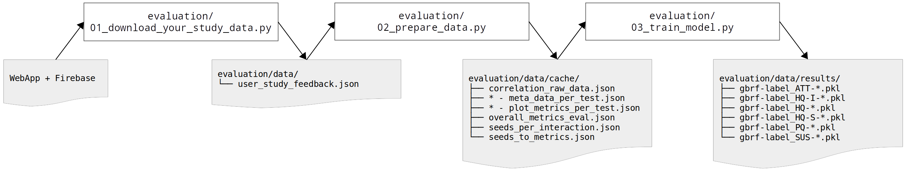

# Interactive Image Segmentation Evaluation

This repository provides a JavaScript and Python implementation of our Usability Evaluation
Framework for Interactive Image Segmentation
Systems.

## User Interface (WebApp)

HTML5 interactive image segmentation application for user interaction log collection.
[→ WebApp](webapp)

> Click here for an interactive [demo](https://mamrehn.github.io/interactive_image_segmentation_evaluation/webapp/index.html).

### Dependencies

 - [AngularJS](https://angularjs.org/) v1.x MVVM Framework
 - [Angular Material](https://material.angularjs.org/latest/) UI Component framework for the material design
 - [Bootstap](http://getbootstrap.com/) HTML, CSS, and JS framework for responsive, mobile first UIs
 - [Firebase](https://www.firebase.com/) Data storage API provider
 - [jQuery](https://jquery.com/) DOM manipulation library

## Evaluation Framework

Python interaction log evaluation framework. [→ Evaluation](evaluation)

### Dependencies

 - [Scikit-learn](https://scikit-learn.org/stable/) Efficient tools for data analysis
 - [MedPy](https://github.com/loli/medpy) Medical image processing in Python
 - [Scikit-image](https://scikit-image.org/) Algorithms for image processing
 - [Joblib](https://joblib.readthedocs.io/en/latest/) Persistence and parallelization tool
 - [Cython](https://cython.org/) Static compiler for C/Python files
 - [Tqdm](https://github.com/tqdm/tqdm) Progress bar for Python
 - [Zenlog](https://github.com/ManufacturaInd/python-zenlog) Straightforward script logging

## Paper 

M. Amrehn, R. Kortekaas, M. Strumia, M. Weingarten, M. Kowarschik, A. Maier "A Semi-Automated Usability Evaluation Framework for Interactive Image Segmentation Systems."
